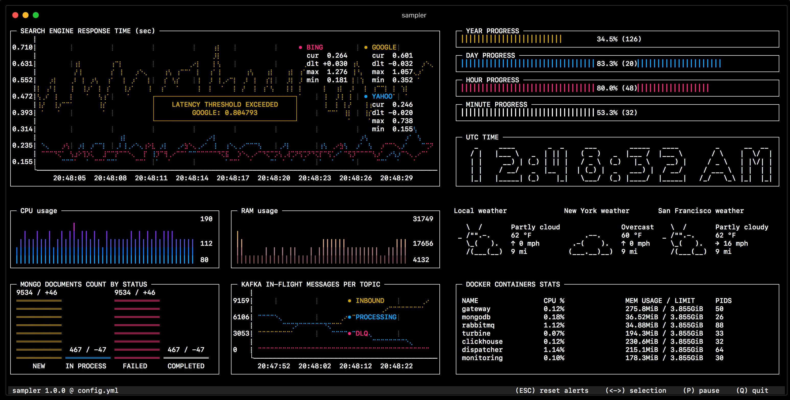

# Introduction
## Motivation
A container is a piece of software, that gather all the code and the dependencies to be able to run an application on any environment. The container contains code, runtime, system tools, system libraries and settings. The application is isolated from its environment. 
Contrary to virtual machines, containers can share commune layers and use fewer resources.

Dockers containers are the most popular ones. 

Containers are dynamic, and monitoring containers is important to :
- catch problems early
- optimize resource allocation
  
## What is sampler ? 
[Sampler](https://sampler.dev/) is a monitoring tool to visualize, alert and execute shell commands. It is configured with a simple yaml file, is serverless and easy to set up, contrary to more advanced system like Prometheus with Grafana. 
It is a tool adapted for the development phase.
 

## What you will learn 
- Monitoring docker containers
- Configuring a basic dashboard with sampler

## Prerequisites
- Vim
- Basic knowledge of docker. 

