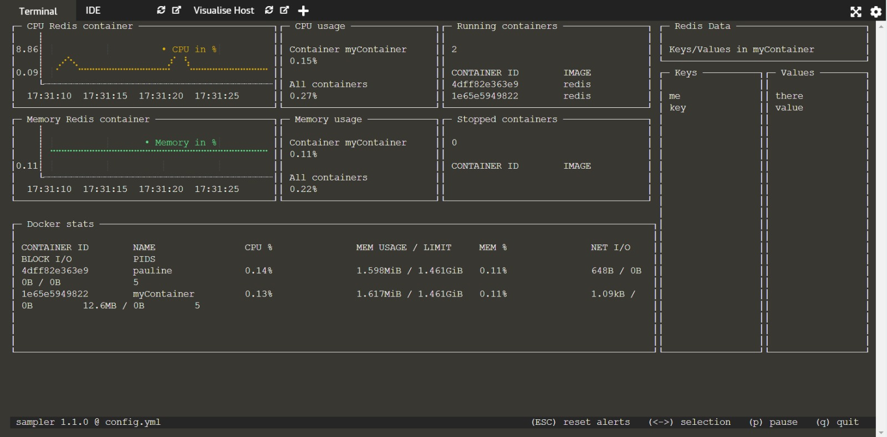

## Monitoring a Docker container
The main resources monitored are generally
- CPU
- memory
- network
- disk read/rewrite  

These resources can be seen with the command `docker stats`, but we will now put them into the config file.

We will now create our Docker monitoring dashboard, you can remove the previous components of your config file (it should only contain the "variables" part).
## Memory and CPU usage
This sampler component will create a timechart for both the CPU and memory usage.
```yaml
runcharts:
  - title: CPU Redis container
    position: [[0, 0], [25, 10]]
    rate-ms: 1000
    legend:
        enabled: true
        details: false
    scale: 2
    items:
      - label: CPU in %
        color: 178
        sample: docker stats $containerName --no-stream --format {{.CPUPerc}} | cut -d '%' -f 1
  - title: Memory Redis container
    position: [[0, 10], [25, 10]]
    rate-ms: 1000
    legend:
        enabled: true
        details: false
    scale: 2
    items:
      - label: Memory in %
        color: 78
        sample: docker stats $containerName --no-stream --format {{.MemPerc}} | cut -d '%' -f 1
```{{copy}}

This code defines the two runcharts. We have already seen the labels 'title' and 'sample'. The label 'position' defines where the component should be in the dashboard. The place and size of a component can also be changed with the arrows on the dashboard. The label 'rate-ms' gives the frequency of the data updates.
The shell command `docker stats $containerName --no-stream --format {{.CPUPerc}} | cut -d '%' -f 1` is based on the shell command seen above. We add the `--no-stream` property as sampler takes care of the update. The last part `--format {{.CPUPerc}} | cut -d '%' -f 1` enables to filter the data to keep only the CPU percentage. Then it splits the text with the separator "%", and keeps only the first part as sampler is expecting a number and not a percentage.

## Global vision of all our containers
In the previous charts, we focused only on one container, but we may also want to have a vision of all resources used by the running containers. We will now add two textboxes containing respectively the CPU and memory usages, of both the selected container and all containers.

```yaml
textboxes:
  - title: CPU usage
    rate-ms: 500
    position: [[25, 0], [15, 10]]
    sample: echo Container $containerName && docker stats $containerName --no-stream --format {{.CPUPerc}} && echo '\nAll containers' && docker stats --no-stream --format {{.CPUPerc}} | awk '{sum += $0} END {print sum"%"}'
  - title: Memory usage
    rate-ms: 500
    position: [[25, 10], [15, 10]]
    sample: echo Container $containerName && docker stats $containerName --no-stream  --format {{.MemPerc}} && echo '\nAll containers' && docker stats --no-stream --format {{.MemPerc}} | awk '{sum += $0} END {print sum"%"}'
```{{copy}}

Let's focus on the first sample label:
`echo Container $containerName && docker stats $containerName --no-stream --format {{.CPUPerc}} && echo '\nAll containers' && docker stats --no-stream --format {{.CPUPerc}} | awk '{sum += $0} END {print sum"%"}'`

This shell command concatenates different commands:
 - `echo Container $containerName` to display text
 - `docker stats $containerName --no-stream --format {{.CPUPerc}}` is similar to the one seen above
 - `docker stats --no-stream --format {{.CPUPerc}} | awk '{sum += $0} END {print sum"%"}'` sums the CPU usage of all the containers

3 additional textboxes components can be added. One displaying the docker statistics and 2 others printing the running and stopped containers. You can paste the following code into the "textboxes" section of your configuration file. Note that the "textboxes:" key is not added this time as there should only be one entry for each kind of component.
```yaml
  - title: Docker stats
    position: [[0, 20], [60, 15]]
    sample: docker stats --no-stream
  - title: Running containers
    rate-ms: 500
    position: [[40, 0], [20, 10]]
    sample: docker container ls | awk '{sum += 1} END {print sum-1}' && echo && docker container ls --format "table {{.ID}}\t{{.Image}}"
  - title: Stopped containers
    rate-ms: 500
    position: [[40, 10], [20, 10]]
    sample: docker ps --filter "status=exited" | awk '{sum += 1} END {print sum-1}' && echo && docker ps --filter "status=exited" --format "table {{.ID}}\t{{.Image}}"
```{{copy}}


## Printing the Redis data
As we can execute any shell command, we can create more complicated components.
The three following textboxes form a block that will give you a vision of what is currently stored in your Redis store. One should pay attention that the CPU usage increases every time, the updates are fetched (every 5 seconds).

```yaml
  - title: Redis Data
    position: [[60, 0], [20, 5]]
    sample: echo Keys/Values in $containerName
    border: true
  - title: Keys
    rate-ms: 5000
    position: [[60, 5], [10, 30]]
    sample: docker exec $containerName redis-cli keys \*
  - title: Values
    rate-ms: 5000
    position: [[70, 5], [10, 30]]
    sample: docker exec $containerName redis-cli keys \* | while read line ; do docker exec $containerName redis-cli get $line ; done
```{{copy}}

You can try to add a new key-value pair to your container in another terminal. The data appear within 5s (the updating time) in the dashboard.
`docker exec myFirstRedisContainer redis-cli set apple 50kr`{{execute}}

You should now have a nice dashboard:
<br>


As notified in the introduction, you can see that your configuration file can easily be reused for another project or to monitor another container as no information is hard-coded. For example, this .yml file could later be used as a template configuration file for monitoring Redis containers.
