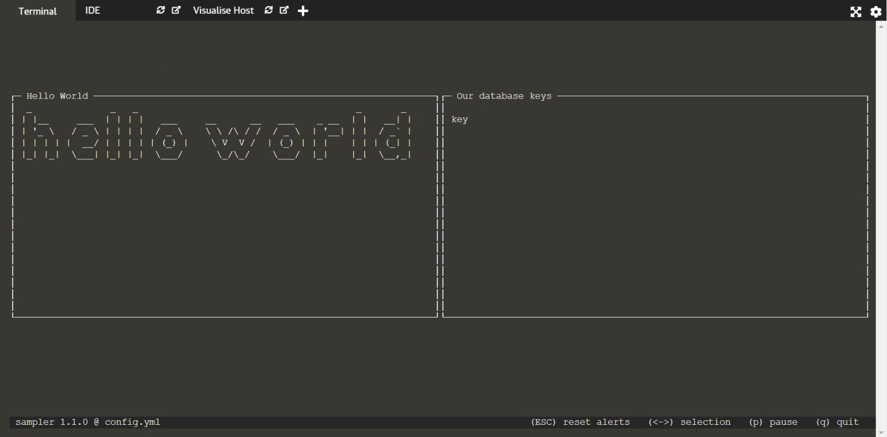

## Installing sampler

We will install sampler on a Linux environment. For other OS, see the sampler documentation.
```
sudo wget https://github.com/sqshq/sampler/releases/download/v1.1.0/sampler-1.1.0-linux-amd64 -O /usr/local/bin/sampler
sudo chmod +x /usr/local/bin/sampler
```{{execute}}
Now run the command :
`sampler --help`{{execute}}

There are 3 options :
- --config to run the YAML config file
- --env to specify variables that overwrite the default ones
- --version to know the version

## Creating a first config file
Now we will create a first basic configuration file.

To create the file :
`vim config.yml`{{execute}}

```yaml
asciiboxes:
  - title: Hello word
    sample: echo Hello world
```{{copy}}
And run it `sampler -c config.yml`{{execute}}

**Small reminder for Vim:** Enter the editing mode by pressing "i". To switch from editing mode to command mode, press "Escape", and in Vim editor press ":w" and then ":q" in command mode, to respectively save and quit.

**Vim alternative:** You can avoid using Vim by creating a file through the command `> config.yml`{{execute}} and using the IDE to edit the file.

You will see in your terminal a simple dashboard with "Hello world" written. To exit the dashboard and go back to the terminal, press "q".

## Sampler boxes
As you can see below, a sampler dashboard is composed of several boxes:
<br>


You can choose among different components :
- Text
  - asciiboxes (middle right in the figure above)
  - textboxes in a more simpler style (bottom right)

- Charts
  - runcharts (top left)
  - sparklines (midlle left)
  - barcharts (bottom left)
  - gauges (top right)

Each component can be personalized by different labels, for example, we had above the 'title' and 'sample' labels.

## A first component linked to our redis container
Let's add to our config file a component that gives us the keys stored in our container.

```yaml
textboxes:
  - title: Our database
    sample: docker exec myFirstRedisContainer redis-cli keys \*
```{{copy}}
And then run it : `sampler -c config.yml`{{execute}}

Your should see:
<br>


As you can see in the configuration file, both components have a 'title' and a 'sample' attribute. There are the two mandatory attributes for every component. The 'sample' attribute takes a shell command as a value. You might have noticed that the sample value in the textbox component is exactly the shell command we used in the previous step to get the list of all keys in "myFirstRedisContainer".

This configuration file works well, but it can be improved by using variables. We can add, at the beginning of our file, the list of the needed variables:
```yaml
variables:
  containerName: myFirstRedisContainer
```{{copy}}
And then replace all the "myFirstRedisContainer" written in hard copy by `$containerName` to refer to the variable. The default value of the variable can be overwritten on start-up using the -e (--env) flag: `sampler -e containerName=<anotherContainerName> -c config.yml`
