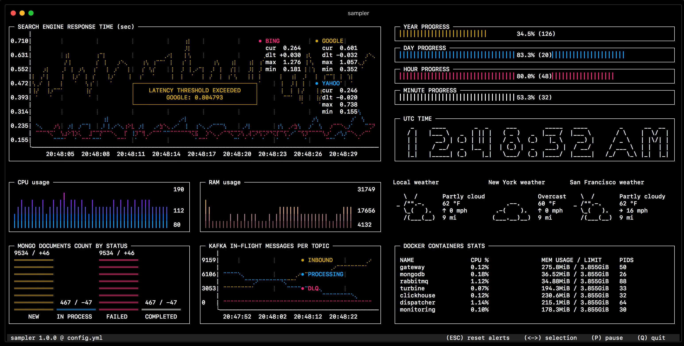

## Installing sampler

We will do the installaing on an linux OS. For other OS, see the sampler documentation
```
sudo wget https://github.com/sqshq/sampler/releases/download/v1.1.0/sampler-1.1.0-linux-amd64 -O /usr/local/bin/sampler
sudo chmod +x /usr/local/bin/sampler 
``` 
{{execute}}
Now run the command :
`sampler --help`{{execute}}

There are 3 options :
- --config to run the YAML config file
- --env to specify variables that overwrite the default one
- --version to know the version

## Creating a first config file
Now we will create a first basic config file. 

To create the file : 
`vim config.yml`{{execute}}

You can now edit the file with Vim or with the IDE.

```yaml
asciiboxes
  - title: Hello word
    sample: echo Hello world
```
And run it `sampler -c config.yaml`{{execute}}
Small reminder: to switch from mode file edition to command, press "Escape", and to Vim editor press ":w" and then ":q" in command mode.  

To go back to the terminal press "q"
You will see in your terminal a simple dashboard with "Hello world" written. (**mettre photo à la place**)


## Sampler boxes
As you can see a sampler dashboard is composed of several boxes, as you can see below
<br>


You can choose among different components :
- Text :
  - asciiboxes
  - textboxes in a more simpler style

- Charts
    - runcharts 
    - sparklines
    - barcharts
    - gauges

Each component can be personalized by differents labels, for example we had above the 'title' and 'sample' labels. 

## A first component linked to our redis container
Let's add to our config file to have a component that give us the keys store in our container, change the below text with your containerId.

```yaml
textboxes
  - title: Our database
    sample: docker exec myFirstRedisContainer redis-cli keys \* 
```
{{copy}}
And then run it : `sampler -c config.yaml`{{execute}}

As you can see from our two component examples, there is a 'title' attribute and the 'sample' attribute. There are the two mandatory attributes to every component. The 'sample' attribute takes a shell command as a value, the same one we typed before. 

This config file works well, but it can be improved by using variables. We can add at the beginning of our file the list of the needed variables:
```yaml
variables:
  containerName: myFirstRedisContainer
```
{{copy}}
And replace all the written in hard copy containerName by `$containerName`, as seen above the variable can be overwritten when running the config by `sampler -e containerName=${yourNewContainerName} -c config.yaml`


